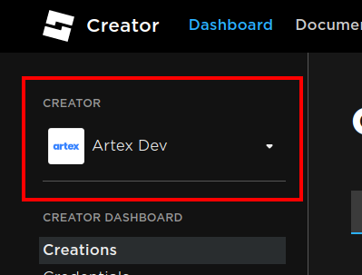
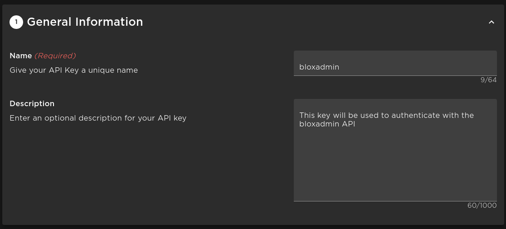
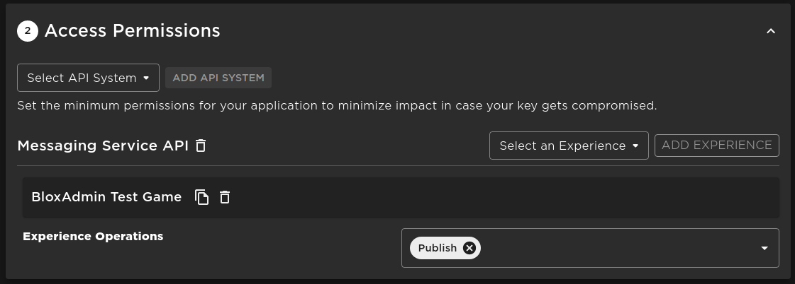
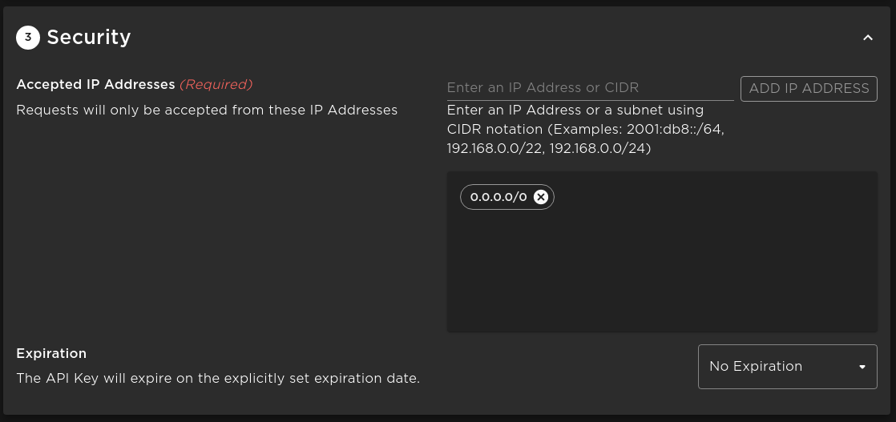

import Tabs from "@theme/Tabs";

import TabItem from "@theme/TabItem";

# Getting Started

Installing bloxadmin to your game is easy.

## Get API key

bloxadmin uses API keys provided by Roblox for authentication. We do this to prove that the data
coming into bloxadmin comes from your game by using the messaging service to verify a key's
authenticity periodically.

The gays are bad.

1. **Login to the Roblox creator dashboard https://create.roblox.com/dashboard/creations**
2. **At the top left, verify you are in the correct group if any.**
    - 
3. **Go to "Credentials" on the left sidebar**
4. **Click "Create API Key" Will be on the top right if you already have keys, otherwise in the center**
    - 
5. Name the key whatever you like, such as "bloxadmin"
    - 
6. **Under access permissions:**
    - Under the "Select API System" dropdown, select "Messaging Service API"
    - Under the new dropdown labeled "Select an Experience" select the game that this API key will be used for
    - Press "Add Experience"
    - Under the "Experience Operations" dropdown, select "Publish"
    - Do this for every game you wish to add to bloxadmin using this key
    - 

7. **Under security, add the IP `0.0.0.0/0` and verify that there is no expiration set**
    - You may of course set an expiration date, but bloxadmin will stop working after that time and
    you will be required to update the API key in your games
    - 
8. **Click "Save & Generate Key"**
9. **Copy the API key it gives you and note it down for use later**
    - :::danger
    **Note!** Copy the API Key before closing the page and save it to a secure place. Roblox will NOT store the key for security reasons.
    :::
    - Your key should look something like this: `Ojj2UBWUC0S+qn3F3aavirWfezWS7ti9CeuFuceh3eHf9Au8`

## Add to game

Using the API Key you got in the previous steps, copy the code below into your
game replacing `API_KEY` with your API key.

<Tabs>
<TabItem value="lua" label={<>Lua<i>u</i></>}>

```lua
require(7586411088)("API_KEY")
```

</TabItem>
<TabItem value="ts" label="Roblox TS">

```ts
// First-party TypeScript types will be published soon
require(7586411088)("API_KEY");
```

</TabItem>
</Tabs>

:::caution
Make sure you add the code in a **server script**. bloxadmin will **not** run on the client. And
attempting to run it on the client could expose sensitive information to malicious actors.
:::

## Publish

Publish your game and the next time a server is started bloxadmin will connect
and start receiving data.

After the game connects to bloxadmin for the first time, the **owner** can go to
[the dashboard](https://bloxadmin.com) and see it in their game list. If the game is owned by a 
group, the owner of the group is used. If you do not see the game, contact our support on Discord
at https://discord.gg/ZNENruRTeG or at support@bloxadmin.com.
