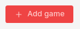
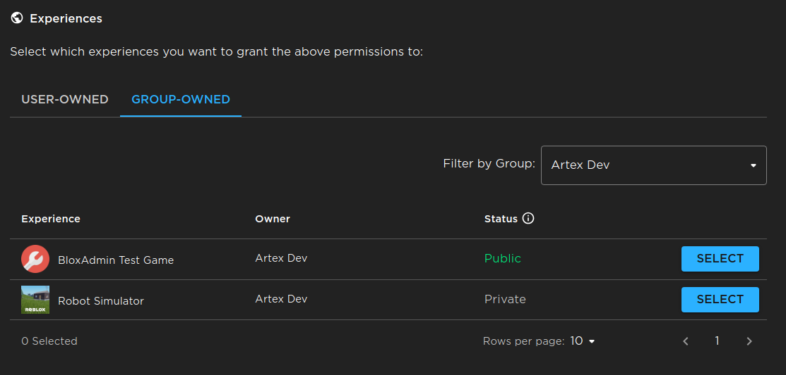
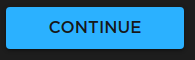
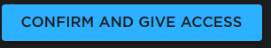
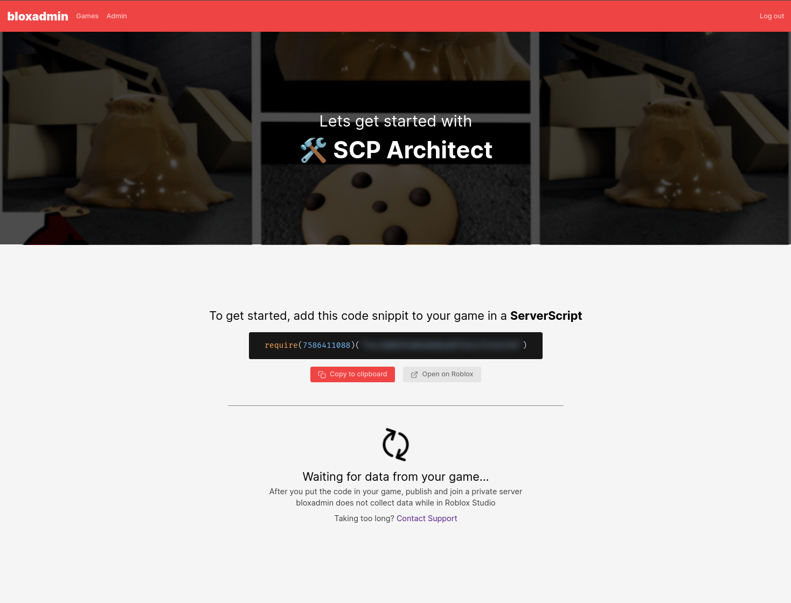
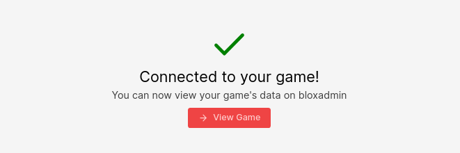

import Tabs from "@theme/Tabs";

import TabItem from "@theme/TabItem";

# Getting Started

Getting started with bloxadmin is easy!

## Add your experience

1. **Head over to [the dashboard](https://bloxadmin.com/games) and signin.**
2. **After signing in, if you're not already there click "Games" on the
   Navigation bar at the top.**
3. **Then, click "Add Game" on the top left, this should bring you to Roblox's
   website.**
   - 
4. **Select "Continue"**
5. **Scroll down and wait for things to load, you should now see a list of
   experiences you have permission to.**
   
6. **Select the experiences you want to add to bloxadmin. If the experience is
   owned by a group, select the "Group-Owned" tab and filter by group**
7. **After clicking "Select" on each of the experiences you would like to add to
   bloxadmin, scroll down and click "Continue"**
   - 
8. **Wait for the timer to count down and click "Confirm and Give Access"**
   - 
9. **You should now be on bloxadmin which is waiting to hear from your game.**
   - 

## Add to game

Copy the code snippet from the step before and add it to your game using Roblox
Studio

<Tabs>
<TabItem value="lua" label={<>Lua<i>u</i></>}>

```lua
require(7586411088)("API_KEY")
```

</TabItem>
<TabItem value="ts" label="Roblox TS">

```ts
// First-party TypeScript types will be published soon
require(7586411088)("API_KEY");
```

</TabItem>
</Tabs>

:::caution

Make sure you add the code in a **server script** stored in
**ServerScriptStorage**. bloxadmin will **not** run on the client. And
attempting to run it on the client could expose sensitive information to
malicious actors.

:::

Currently, using the `require(assetId)` is the only supported way to add
bloxadmin to your game. We understand the security risk it poses to you and your
game, and we will do everything in our power to garentee no harm can or will be
done throught the required script.

If you wish to inspect the source code or add the code statically into your
game, you can find it at https://github.com/bloxadmin/roblox-lib. It is made
using [roblox-ts](https://roblox-ts.com/), please refer their website and
support server if you need help setting it up. We do not currently support any
games adding the bloxadmin library using this method, and you can expect
breaking changes requiring you to update often.

## Publish

Publish your game and open your game on https://www.roblox.com and click the
green play button. If your game already has players, join using a private
server. If you do not have private servers, you will just need to wait until a
new server is started.

:::info

bloxadmin **does not** work or collect any data while you are in Roblox studio.
This is why you must publish your game and join it from the roblox website. We
understand this can make development more difficult and we are working a way to
be able to use test the bloxadmin API while in studio.

:::

After you've joined your game, the dashboard should say "Conncted to your game!"
and you're done! Now you have access to all the features of bloxadmin. Click
"View Game" and poke around in the dashboard or you can read about our features
such as [Remote Config](./guides/remote-config.md)


