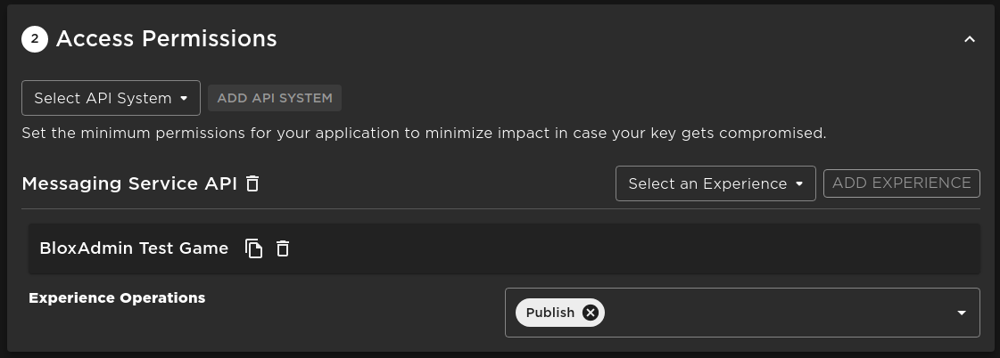

# Roblox Open Cloud

The [Roblox Open Cloud API](https://create.roblox.com/docs/cloud/open-cloud) is
an offical Roblox API that allows third-party services, such as bloxadmin, to
interact with Roblox and perform actions on a user's behalf.

bloxadmin uses API keys provided by Roblox for a more stable way to send
messages to your Roblox games and improve security. In addition, bloxadmin uses
the keys for other optional functionality such as the datastore viewer. As
Roblox creates more APIs under Open Cloud, bloxadmin will be right there behind
them to use it to give you more features.

## Get API key

1. **Login to the Roblox creator dashboard
   https://create.roblox.com/dashboard/creations**
2. **At the top left, verify you are in the correct group if any.**
   - 
3. **Go to "Credentials" on the left sidebar**
4. **Click "Create API Key" Will be on the top right if you already have keys,
   otherwise in the center**
   - 
5. Name the key whatever you like, such as "bloxadmin"
   - 
6. **Under access permissions:**
   - Under the "Select API System" dropdown, select "Messaging Service API"
   - Under the new dropdown labeled "Select an Experience" select the game that
     this API key will be used for
   - Press "Add Experience"
   - Under the "Experience Operations" dropdown, select "Publish"
   - Do this for every game you wish to add to bloxadmin using this key
   - 

7. **Under security, add the IP `0.0.0.0/0` and verify that there is no
   expiration set**
   - You may of course set an expiration date, but bloxadmin will stop working
     after that time and you will be required to update the API key in your
     games
   - 
8. **Click "Save & Generate Key"**
9. **Copy the API key it gives you and note it down for use later**
   - :::danger **Note!** Copy the API Key before closing the page and save it to
     a secure place. Roblox will NOT store the key for security reasons. :::
   - Your key should look something like this:
     `Ojj2UBWUC0S+qn3F3aavirWfezWS7ti9CeuFuceh3eHf9Au8`

# Save the Key to bloxadmin

Now that you have the key, we need to save it on bloxadmin for it to be used.

1. Go to the [bloxadmin dashboard](https://bloxadmin.com/games)
2. Navigate to the game you created the key for
3. Go to the "Settings" page for the game
   - 
4. Find the "Roblox Config" card
   - 
5. Enter your Open Cloud API Key and click save
6. You're done!
